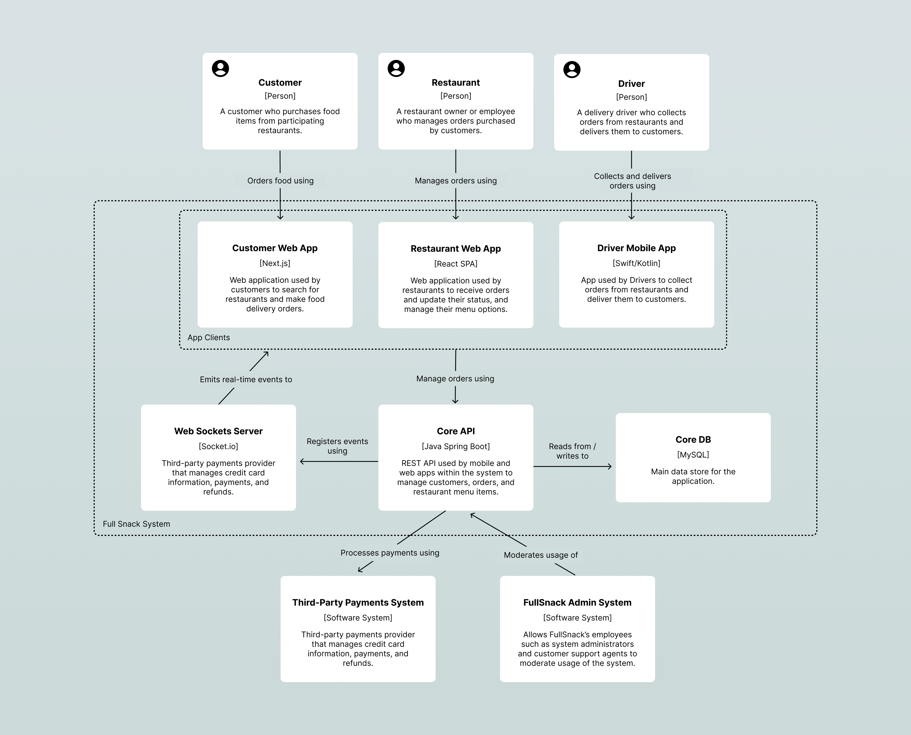

# FullSnack Customer Web Application High-Level Design Doc

## 1. Overview

This document outlines the high-level architecture design for FullSnack's customer-facing web application. FullSnack aims to rebuild its current MVP web application to support future growth and scalability, and the team is preparing to do so in time for the big marketing launch at the end of the year.

This design document addresses the architectural requirements, provides a high-level design, considers alternatives, and outlines a timeline for implementation.

## 2. Context

FullSnack's current MVP web application has limitations that prevent it from scaling with the anticipated growth in both team size and user base. The goal is to design a new architecture that is scalable, modular, and maintainable, allowing the frontend team to work efficiently and deliver new features quickly. The new architecture must also meet the business goals and technical constraints outlined by the stakeholders.

The new customer web application is part of the **FullSnack System**, which is the software system that allows customers to make and track orders, resturants to manage orders, and drivers to collect and deliver orders.

## 3. Goals and Non-Goals

### Goals

- **Scalability**: Design an architecture that can support a growing team and an increasing number of users.
- **Modularity**: Ensure the codebase is modular to allow multiple developers to work in parallel without conflicts.
- **Performance**: Optimize the application for quick load times and smooth user interactions, especially on mobile devices.
- **Accessibility**: Ensure compliance with WCAG 2.2 accessibility standards.
- **Real-Time Updates**: Implement real-time updates for order tracking and delivery status.

### Non-Goals

- **Backend System Overhaul**: This project focuses solely on the frontend architecture. The backend system will remain as is, with only necessary integrations.
- **Native Mobile App Development**: The scope is limited to the web application, and does not include development of native mobile apps.

## 4. High Level Design

We're going to build the Customer Web Application as a monolothic server-side rendered React app using Next.js. Like other app clients, the customer web app will communicate with the core database and any external services using the existing Core API. It will also subscribe to channels on the Web Sockets Server for any features that require real-time communication.

### Container Diagram

### Architectural Style

- **Component-Based Architecture**: Utilize a component-based architecture using React to create reusable UI components.
- **Server-Side Rendered Application**: Use Next.js for server-side rendering, static site generation, and improved performance.
- **Monorepo**: Develop our frontend apps and packages in a monorepo to speed up development and remove friction when sharing code.
- **TypeScript**: Use TypeScript for type safety and better developer experience, while allowing gradual adoption to accommodate all team members.
- **Real-Time Communication**: Integrate WebSockets via Socket.io for real-time updates on order status and driver location.

### Key Components

1. **Home Module**: Serves as the landing page, displaying featured restaurants, promotional banners, and personalized recommendations.

2. **Login Module**: Manages user registration, login, and password recovery.

3. **Delivery Module**: Handles delivery options and real-time order tracking.

4. **Pickup Module**: Manages the process for users to pick up their orders from restaurants.

5. **Restaurant Module**: Displays detailed information about individual restaurants and their menus.

6. **Shopping Cart Module**: Manages user-selected items before finalizing the order.

7. **Menu Item Module**: Displays detailed information and customization options for each menu item.

8. **Search Module**: Enables users to search and filter restaurants and food items.

9. **Profile Module**: Manages user profile information and settings.

### Technology Stack

- **Frontend**: React, Next.js, TypeScript, Redux, Socket.io
- **Backend**: Java Spring Boot (existing), MySQL (existing), WebSockets (existing)
- **Deployment**: AWS infrastructure

## 5. Alternatives Considered

1. **Single Page Application (SPA) with React**: While a client-side rendered SPA provides a smooth user experience, it lacks the page load performance and scalability benefits of server-side rendering offered by Next.js.
2. **Vue.js**: Although some team members are familiar with Vue.js, the majority have experience with React and Next.js, making it a more suitable choice.
3. **Remix**: Remix was another good candidate, but noone on the team was familiar with it and the unknown unknowns posed a bigger risk than using Next.js given the tight deadline.

## 6. Timeline

### Phase 1: Discovery and Planning (July 2024 - August 2024)

- Finalize requirements and gather detailed specifications.
- Design the architecture and create detailed technical documentation.

### Phase 2: Initial Development (September 2024 - October 2024)

- Set up the project structure and configure the development environment.
- Implement core modules: Home, Login, Search, and Profile.

### Phase 3: Feature Development (October 2024 - November 2024)

- Implement remaining modules: Delivery, Pickup, Restaurant, Shopping Cart, and Menu Item.
- Integrate real-time updates using WebSockets.
- Conduct performance and scalability testing.

### Phase 4: Testing and Deployment (November 2024)

- Perform comprehensive testing (unit, integration, and end-to-end tests).
- Optimize for performance and accessibility.
- Deploy to production and monitor for issues.

## 7. Risks and Open Questions

### Risks

- **Team Scaling**: As the team triples in size, coordination and communication may become challenging.
- **Performance Bottlenecks**: Ensuring optimal performance for all users, especially on mobile devices, may require significant optimization efforts.
- **Real-Time Updates**: Implementing and testing real-time features can be complex and prone to issues.

### Open Questions

- **Shopping Cart Persistence**: Should the shopping cart contents be persisted for authenticated users?
- **Search Auto-Complete**: Will the search feature include auto-complete functionality, and is there an API endpoint for this?
- **Additional Real-Time Features**: Are there other features requiring real-time functionality beyond order tracking and delivery status?

## 8. Appendix

### References

- [Figma UI Designs](https://www.figma.com/design/cKot2kO0cg2PpR3QwgppXm/FullSnack-Spec?node-id=0-1&t=gBOwglj8jVc5t9JR-1)
- [Architectural Requirements Document](requirements.md)
- [Domain Model](./domain-model.md)
- [ADR1: Using Next.js](./adr.md)
