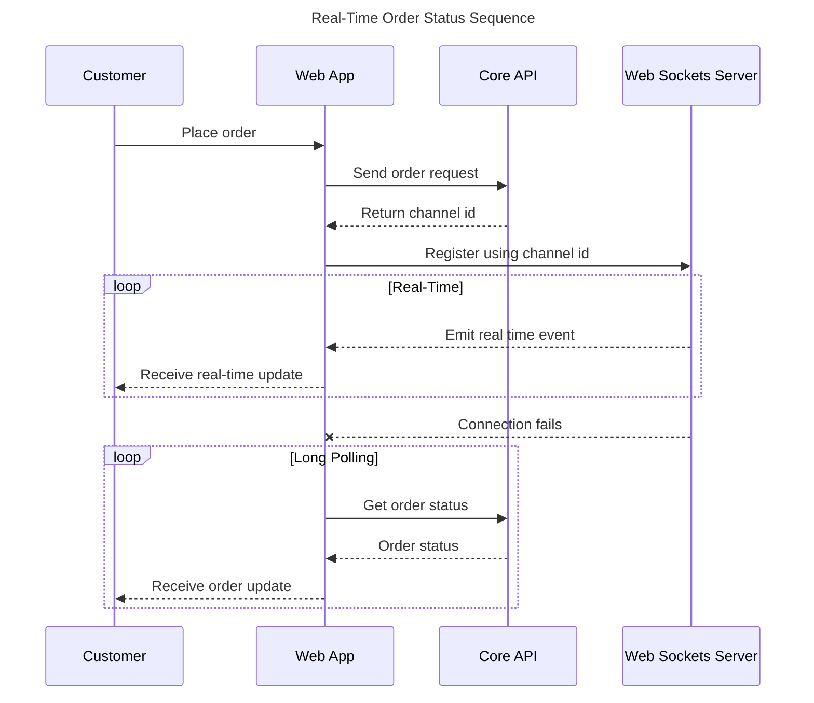
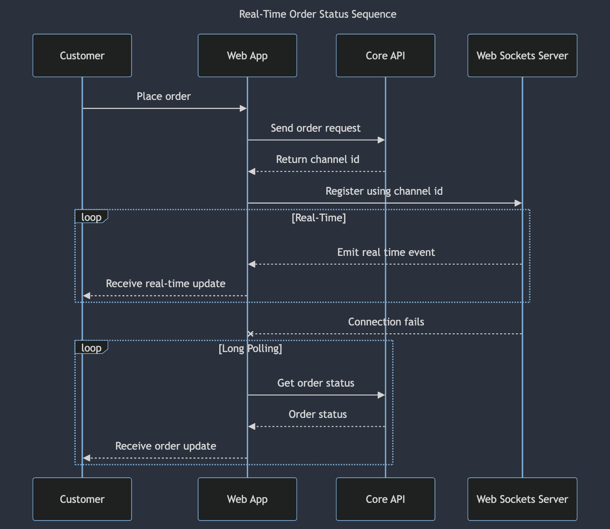

# Real-Time Order Status Sequence

## Description

When a customer places an order, the web app makes a request to the Core API which creates the order and returns a channel id. The web app then uses this channel ID to subscribe to the web sockets server, which emits real-time events when the order status changes. If the connection with the web socket server drops at any point, the web app will start polling Core API with the latest order status.

## Mermaid.Live URL

https://mermaid.live/edit#pako:eNp9U12L2zAQ_CtCz_mSnNixHw6O61EKhQuXQqHkRZEVW5wsufI6XBry37uKneaT5snZnZmdWUl7Kl2uaEYb9btVVqovWhReVCtL8AcajCLvSpjhD10p8uZz5ckSBLQNWfaMDloLD1rqWlggL20DrlL-vvNTrclzXT-gOK_I8-LbY8rSyQ8FYaTfBtkOdRozfHrqdTOyMEIq4oLPDtR3EHMakaGMzTsM8SFEA71gjxheKr4raL0lshTWKkN0fqt7bzCQCt0A6reNtsUd2ThXn9fa1U6i11JXVl4rDehYGDwYPA21VRauycFRiNpvJhiRSm_VkTU8sto6F9DPxD2c09wO_vw398WhewnaWbIR2jQXIb47jLdwxmDMeyuXS_-qoN95c7w_Z_TDtb89hP43Y6d-k48OKIIqoXO85PtQXlEoFW6dZviZC_-xoit7QJxowS13VtIMfKsGtFPqH8R18TXX4DzNNsI0WDRO4Gia7Sns6vCawumjonR2o4tQb73BcglQN9l4HNqjQkPZrkfSVeNG5yVe-XKbxuOYx3PBIxUnkZhFUS7XLJ1v-JRt8mTCuKCHw4DiywiqnzRjLBqlc57OknjK0gmfpQO6o9mQs1HE49mcpVEcRSyKEqT9cQ6DsBFnc87jSTJjCZ_y6VHv17HXB_KuLcr-3-Evcl9UFQ

