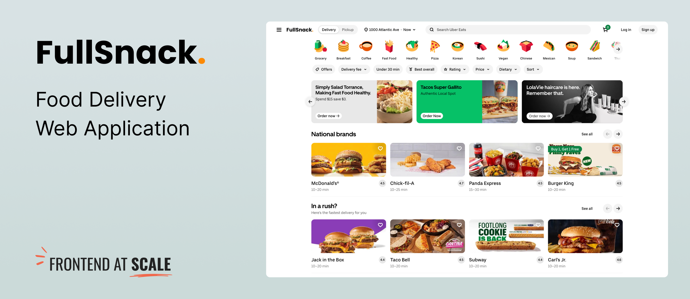

# Project Spec

## 0. Project Overview

**FullSnack** is a recently launched **food delivery service** (similar to Uber Eats, or DoorDash) that is looking to **rebuild their customer-facing web application**, following a successful MVP.

FullSnack currently has a small team of four frontend engineers, but the team is expected to triple in size in the next 12 months. It's clear that the current customer-facing web app used for the MVP will not scale to the needs of a larger team.

Your goal as the frontend architect of this project is to **design the architecture of FullSnack's customer-facing web application**. This includes gathering requirements, designing an architecture that meets those requirements, and support the frontend team during implementation.

## 1. FullSnack Software System

_This section describers the entire FullSnack software system. This includes the users of the system, as well as all the applications, databases, and APIs the system is made of. The application that we're building (the customer-facing web app) is a part of this system._

### System Context

_This is a zoomed out view of the FullSnack system and the context around it. The system context diagram below follows the guidelines of the C4 Model for visualizing software architecture._

#### System Users

- **👩🏻 Customer** — Buyers purchasing food through FullSnack. They use the Customer Web App client to search restaurants and food options, make orders, pay for them, and keep track of the order status.
- **🧑🏽‍🍳 Restaurant** — Restaurant owners and employees. They use the Restaurant Web App client to receive orders made by customers, update the order's status, and update their menu options in the system.
- **🛵 Driver** — Delivery drivers. They use the Driver Mobile App client to collect orders from restaurants and deliver them to customers.

#### External Systems

- **Third-party Payment System** — Third-party software system used by FullSnack's applications to manage payments, refunds, and credit card information.
- **FullSnack Admin System** — Software system used by FullSnack's employees such as system administrators and customer support agents to manage and moderate the FullSnack system.

#### System Context Diagram

### System Containers

_These are the building blocks of the system. Use this list as well as the system context diagram above to build the container diagram for the FullSnack software system._

- **Customer Web App** — This is the app that we're designing the architecture for. It's a web application used by customers to search for restaurants and make food delivery orders.
- **Restaurant Web App** [React SPA] — The web application used by restaurants to receive orders and update their status and manage their menu options.
- **Driver Mobile App** [Native iOS + Android] — The app used by Drivers to collect orders from restaurants and deliver them to customers.
- **Core API** [Java Spring Boot] — REST API used by all mobile and web apps within the system to manage customer information, orders, and restaurant menu items. The Core API also acts as a gateway to external systems (i.e. third-party payment and admin systems.)
- **Core Database** [MySQL] — Main data store for the application. The Core API reads from and writes to this database.
- **WebSockets Server** [Socket.io] — Used to communicate real-time events with registered clients (e.g. updating order status or broadcasting a driver's location.)

#### Container Diagram

_To be completed... by you! See Exercise 1 for more details._

---

## 2. FullSnack Customer Web Application

_This section describes the customer-facing application in more detail. It's meant to give you a high-level understanding of the app we're designing the architecture for, and it should have enough information to complete the exercises in the workshop._

### UI Designs

👉🏽 Check out the [Figma spec](https://www.figma.com/design/cKot2kO0cg2PpR3QwgppXm/FullSnack-Spec?node-id=0-1&t=gBOwglj8jVc5t9JR-1).

_Note: This is not an **actual** UI spec—it's just screenshots from Uber Eats with a different logo. We'll refer to the spec in a few modules, but it's provided mainly for illustration purposes. UI copyright belongs to Uber Eats._

### Functional Requirements

_This section lists some of the main functional requirements of FullSnack's web app. This is more of a functionality overview to help guide some of your architectural decisions._

#### Authentication

- Customers can browse the app without being authenticated.
- Customers can create an account using email, phone number, or social media accounts.
- Customers can authenticate using their created account credentials.
- Authenticated customers can update their profile information.
- Authenticated customers can reset their passwords if forgotten.

#### Browsing and Searching

- Customers can browse restaurants and food items without authentication.
- Customers can search for restaurants by name.
- Customers can search for restaurants by type of food.
- Customers can filter search results by various criteria (e.g., ratings, delivery time, distance).

#### Favorites and Recommendations

- Authenticated customers can add restaurants to their favorites.
- Authenticated customers can add food items to their favorites.
- The app can provide personalized restaurant and food item recommendations based on customer preferences and order history.

#### Ordering Food

- Customers can add food items to a shopping cart (with or without authentication).
- Customers can customize food items (e.g., add toppings, select portion size).
- Customers can apply promo codes or discounts to their orders.
- Customers can place an order from a restaurant, including multiple items per order (only authenticated customers).
- Customers can schedule orders for later delivery or pickup.

#### Payment

- Customers can choose from multiple payment methods (e.g., credit/debit cards, digital wallets).
- Customers can save payment information for future orders.
- Customers can view an order summary and total cost before confirming the order.
- Customers can receive an email confimation with a digital receipt after placing an order.

#### Order Tracking

- After placing an order, customers can see a real-time tracker of their order status.
- Customers receive notifications about their order status (e.g., order confirmed, food being prepared, out for delivery).
- Once an order is out for delivery, customers can see a real-time map showing the driver's current location.
- Customers can contact the delivery driver or the restaurant in case of issues.

#### Ratings and Reviews

- Customers can rate and review restaurants and food items after receiving their orders.
- Customers can view ratings and reviews from other users.
- Customers can receive a notification if a restaurant responds to one of their reviews.

### Architectural Requirements

👉🏽 Check out the [requirements doc](requirements.md).
